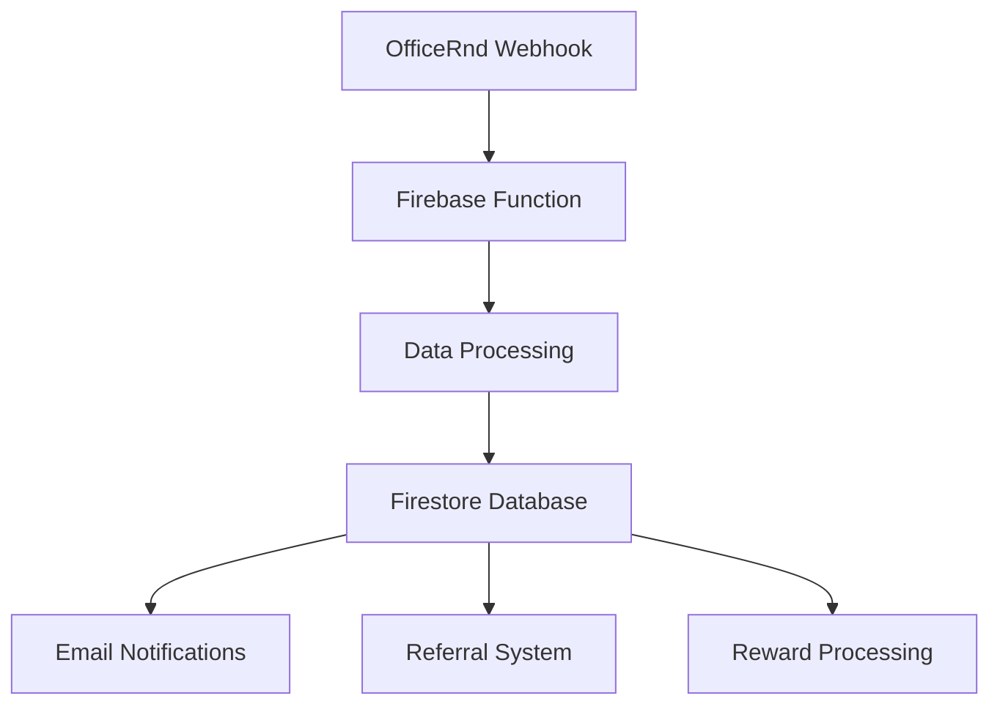

# Savage Coworking

A comprehensive platform that connects various services and platforms to streamline coworking space management, including OfficeRnd integration, referral systems, and automated workflows.

## 🚀 Quick Start

```bash
# Clone the repository
git clone https://github.com/Kikolator/savage.git
cd savage
```

## 📋 Prerequisites

- **Node.js** (v18 or higher)
- **Firebase CLI** (`npm install -g firebase-tools`)
- **Flutter SDK** (for frontend development)
- **Firebase Project** with the following services enabled:
  - Cloud Functions
  - Firestore Database
  - Cloud Scheduler
  - Secret Manager

## 🛠️ Installation & Setup

### Backend (Firebase Functions)

```bash
cd functions
npm install
```

### Frontend (Flutter)

```bash
cd frontend/referral
flutter pub get
```

### Environment Configuration

1. Create a `.env` file in the root directory
2. Configure the following environment variables:
   - `FIREBASE_PROJECT_ID`
   - `SENDGRID_API_KEY`
   - `OFFICE_RND_SECRET`
   - `OFFICE_RND_WEBHOOK_SECRET`
   - `TYPEFORM_SECRET`
   - `SAVAGE_SECRET`

## 🧪 Development

### Running Locally

```bash
# Start Firebase emulators
firebase emulators:start

# Run backend tests
cd functions
npm test

# Run frontend tests
cd frontend/referral
flutter test
```

### Development Workflow

1. **Feature Development**: Create feature branches from `main`
2. **Testing**: Write tests for new functionality
3. **Code Review**: Submit pull requests for review
4. **Deployment**: Merge to `main` triggers automatic deployment

## 🧪 Testing

### Backend Tests

```bash
cd functions
npm test                    # Run all tests
npm run test:watch         # Run tests in watch mode
npm run test:coverage      # Generate coverage report
```

### Frontend Tests

```bash
cd frontend/referral
flutter test              # Run all tests
flutter test --coverage   # Generate coverage report
```

### Integration Tests

```bash
# Test API endpoints
npm run test:integration

# Test scheduled functions
npm run test:scheduled
```

## 🚀 Deployment

### Staging Deployment

```bash
# Deploy to staging environment
firebase use staging
firebase deploy
```

### Production Deployment

```bash
# Deploy to production environment
firebase use production
firebase deploy
```

### Deployment Verification

After deployment, verify:
- [ ] All functions are deployed successfully
- [ ] Scheduled jobs are created
- [ ] API endpoints are accessible
- [ ] Database rules are applied

## 🔧 Configuration

### Firebase Configuration

The project uses Firebase for backend services. Configure your Firebase project in `firebase.json` and ensure all required services are enabled.

### Environment Variables

| Variable | Description | Required |
|----------|-------------|----------|
| `FIREBASE_PROJECT_ID` | Firebase project identifier | Yes |
| `SENDGRID_API_KEY` | SendGrid API key for email services | Yes |
| `OFFICE_RND_SECRET` | OfficeRnd API secret | Yes |
| `OFFICE_RND_WEBHOOK_SECRET` | OfficeRnd webhook verification secret | Yes |
| `TYPEFORM_SECRET` | Typeform webhook secret | Yes |
| `SAVAGE_SECRET` | Internal API secret | Yes |

## 🐛 Troubleshooting

### Common Issues

#### Firebase Emulator Issues
```bash
# Clear emulator data
firebase emulators:start --only firestore --import=./emulator-data
```

#### Secret Access Errors
If you encounter secret access errors during deployment:
- Ensure all secrets are properly configured in Firebase Secret Manager
- Check that the lazy config pattern is applied to all services

#### Test Failures
```bash
# Clear test cache
npm run test:clear

# Run specific test file
npm test -- --testNamePattern="specific test name"
```

### Debug Mode

Enable debug logging by setting the `DEBUG` environment variable:
```bash
export DEBUG=*
npm run dev
```

## 📚 Documentation

### Backend Documentation
- [Functions Documentation](functions/docs/) - Complete backend documentation
  - [API Reference](functions/docs/api.md) - Complete API reference
  - [Functions Overview](functions/docs/functions.md) - Cloud Functions architecture
  - [Firestore Testing](functions/docs/FIRESTORE_TESTING.md) - Database testing best practices
  - [SendGrid Integration](functions/docs/sendgrid.md) - Email service guide
  - [OfficeRnd Integration](functions/docs/office-rnd.md) - Integration guide
  - [Trialday Migration](functions/docs/trialday-migration.md) - Data migration guide

### Frontend Documentation
- [Frontend Documentation](frontend/docs/) - Complete frontend documentation
  - [Hosting Guide](frontend/docs/hosting.md) - Deployment instructions
  - [Referrals System](frontend/docs/referrals.md) - Referral implementation

## 🏗️ Architecture

### System Overview

The Savage Coworking platform consists of:

- **Backend**: Firebase Cloud Functions with TypeScript
- **Database**: Firestore NoSQL database
- **Frontend**: Flutter web application
- **Email**: SendGrid integration
- **External APIs**: OfficeRnd, Typeform integrations

### OfficeRnd Integration

The OfficeRnd integration provides seamless synchronization between the coworking management platform and our internal systems.



**Key Benefits:**
- Real-time member status updates
- Automated email confirmations
- Integrated referral tracking
- Seamless data synchronization

## 🤝 Contributing

1. Fork the repository
2. Create a feature branch (`git checkout -b feature/amazing-feature`)
3. Commit your changes (`git commit -m 'Add amazing feature'`)
4. Push to the branch (`git push origin feature/amazing-feature`)
5. Open a Pull Request

### Code Style

- Follow TypeScript best practices
- Use ESLint and Prettier for code formatting
- Write comprehensive tests for new features
- Update documentation for API changes

## 📄 License

This project is licensed under the MIT License - see the [LICENSE](LICENSE) file for details.

**MIT License Benefits:**
- ✅ Free to use, modify, and distribute
- ✅ Commercial use allowed
- ✅ Attribution required
- ✅ Liability protection for authors
- ✅ Compatible with most other licenses

## 📞 Support

For support and questions:
- Create an issue in the repository
- Contact the development team
- Check the troubleshooting section above

---

**Current Branch**: `main`  
**Last Updated**: December 2024

