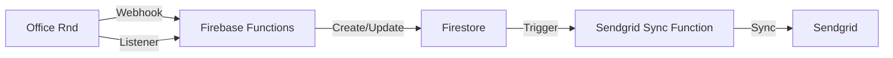
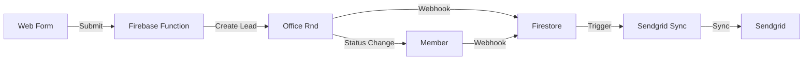

# Office Rnd Integration System

## Architecture Overview

This system implements a robust integration between Office Rnd, Firestore, and Sendgrid. Office Rnd serves as the primary system handling all core business logic, while Firestore acts as a mirror/backup system and integration hub.

### System Components

1. **Office Rnd (Primary System)**
   - Core business logic and member management
   - Member lifecycle management (lead → trial → member)
   - Billing and payment processing
   - Member portal and admin dashboard
   - Built-in reporting and analytics
   - Primary member communication system

2. **Firestore (Mirror/Backup)**
   - Mirrors Office Rnd data
   - Provides data redundancy
   - Enables custom queries and reporting
   - Triggers downstream integrations
   - Serves as a safety net for potential migration
   - Maintains sync status with Office Rnd

3. **Sendgrid**
   - Email communication platform
   - Receives member data for email campaigns
   - Secondary system for member data

### Data Flow



1. **Office Rnd to Firestore**
   - Real-time updates via webhooks
   - Periodic sync via listener function
   - Maintains data consistency
   - Provides data redundancy

2. **Firestore to Sendgrid**
   - Triggered by Firestore document changes
   - Implements retry logic for failed syncs
   - Maintains sync status

### Member Lifecycle Flow



1. **Lead Creation**
   - Web form submits to Firebase Function
   - Function creates lead in Office Rnd
   - Office Rnd webhook updates Firestore
   - Sendgrid sync triggered for welcome email

2. **Lead to Member Transition**
   - Office Rnd handles status change
   - Webhook updates Firestore
   - Sendgrid sync triggered for member onboarding

## Data Structure

### Member Document

```typescript
interface Member {
  id: string;
  officeRndId: string;
  email: string;
  name: string;
  status: 'lead' | 'trial' | 'member' | 'inactive';
  // other member fields from Office Rnd
  syncStatus: {
    lastOfficeRndSync: Timestamp;
    lastSendgridSync: Timestamp;
    officeRndStatus: 'synced' | 'pending' | 'failed';
    sendgridStatus: 'synced' | 'pending' | 'failed';
    error?: string;
  };
  metadata: {
    createdAt: Timestamp;
    updatedAt: Timestamp;
    createdBy: string;
    updatedBy: string;
  };
}
```

## Development Guidelines

### 1. Code Organization

- Keep functions modular and single-purpose
- Implement proper error handling
- Use TypeScript for type safety
- Follow Firebase Functions best practices
- Maintain clear sync status tracking

### 2. Testing

- Write unit tests for all functions
- Implement integration tests for data flow
- Test error scenarios and edge cases
- Maintain test coverage
- Test sync reliability

### 3. Error Handling

- Implement proper error logging
- Use retry mechanisms for transient failures
- Maintain error state in Firestore
- Alert on critical failures
- Handle webhook failures gracefully

### 4. Security

- Validate all webhook requests
- Implement proper authentication
- Follow least privilege principle
- Secure sensitive data
- Regular backup verification

### 5. Monitoring

- Set up proper logging
- Monitor function execution
- Track sync status
- Alert on failures
- Monitor data consistency

## Future Considerations

1. **Migration Path**
   - Maintain complete data mirror in Firestore
   - Regular backup verification
   - Document data mapping
   - Plan for potential Office Rnd replacement

2. **Custom Features**
   - Build custom reporting on Firestore data
   - Implement additional integrations
   - Add custom analytics
   - Develop specialized member features

3. **System Evolution**
   - Monitor Office Rnd limitations
   - Track custom feature requirements
   - Plan for potential system replacement
   - Maintain data portability

## Getting Started

// TODO

## Contributing

1. Follow the established code style
2. Write tests for new features
3. Update documentation
4. Submit pull requests

## License

[Your License Here] 