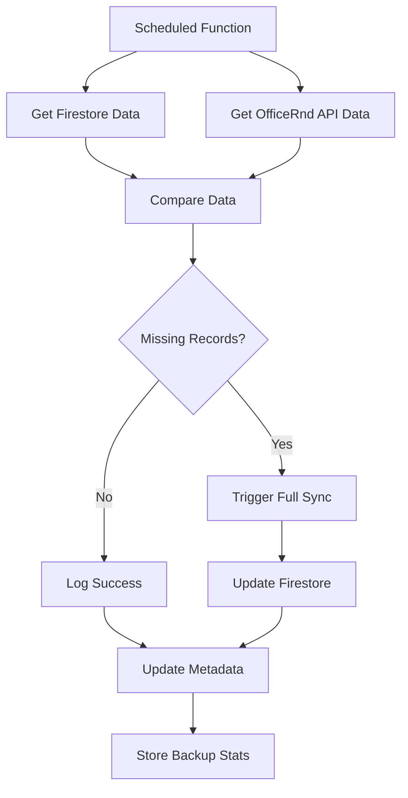

# OfficeRnd Backup System

## Overview

The OfficeRnd backup system provides automated data validation and recovery to ensure data consistency between OfficeRnd and Firestore. This system runs daily to catch any missed webhooks and maintain data integrity.

## Architecture

### Components

1. **Scheduled Backup Function** - Runs every 24 hours
2. **Data Comparison Logic** - Compares Firestore vs OfficeRnd API data
3. **Automatic Recovery** - Triggers full sync when discrepancies are detected
4. **Monitoring Endpoint** - Provides real-time backup status

### Data Flow



## Implementation

### Scheduled Backup Function

**Location**: `functions/src/scheduled-events/on-schedule-events/office-rnd-scheduled-events.ts`

**Schedule**: Every 24 hours at UTC

**Functionality**:
- Compares members, opportunities, and companies between Firestore and OfficeRnd API
- Identifies missing records
- Triggers full sync if discrepancies are found
- Logs backup statistics
- Updates backup metadata

### Monitoring Endpoint

**Endpoint**: `GET /v1/office-rnd/backup-status`

**Response**:
```json
{
  "backup": {
    "lastBackup": "2024-01-15T10:00:00Z",
    "status": "completed",
    "missingRecords": 0
  },
  "currentStats": {
    "members": {
      "firestore": 150,
      "api": 150,
      "missing": 0
    },
    "opportunities": {
      "firestore": 75,
      "api": 75,
      "missing": 0
    },
    "companies": {
      "firestore": 25,
      "api": 25,
      "missing": 0
    }
  },
  "syncHealth": {
    "members": "healthy",
    "opportunities": "healthy",
    "companies": "healthy"
  },
  "lastChecked": "2024-01-15T14:30:00Z"
}
```

## Backup Metadata

The system stores backup metadata in Firestore at:
`/officeRndMetadata/backup-metadata`

**Fields**:
- `lastBackup`: Timestamp of last backup
- `firestoreMembers`: Number of members in Firestore
- `apiMembers`: Number of members in OfficeRnd API
- `missingRecords`: Total number of missing records
- `status`: 'completed' or 'failed'
- `error`: Error message if backup failed
- `updatedAt`: Last update timestamp

## Error Handling

### Backup Failures

When the backup function fails:
1. Error is logged to Firebase Functions logs
2. Error is stored in Firestore `/errors` collection
3. Backup metadata is updated with failure status
4. System continues to operate normally

### Recovery Scenarios

1. **Webhook Failures**: Backup catches missed webhooks and triggers full sync
2. **API Outages**: Backup retries on next scheduled run
3. **Data Corruption**: Full sync rebuilds data from OfficeRnd API
4. **Network Issues**: Automatic retry with exponential backoff

## Monitoring and Alerts

### Health Checks

Monitor these metrics:
- Backup success rate
- Number of missing records
- Sync health status
- Last backup timestamp

### Alert Conditions

Set up alerts for:
- Backup failures (status = 'failed')
- High number of missing records (>10)
- Backup not run in 48+ hours
- Sync health showing 'out_of_sync'

### Dashboard Metrics

Key metrics to track:
- **Data Consistency**: Percentage of records in sync
- **Backup Reliability**: Success rate of scheduled backups
- **Recovery Time**: Time to restore missing data
- **Data Volume**: Growth of member/opportunity/company data

## Usage Examples

### Check Backup Status

```bash
curl -X GET "https://api.savage-coworking.com/v1/office-rnd/backup-status"
```

### Manual Backup Trigger

```bash
# Trigger backup via Firebase Functions
firebase functions:call officeRndDataBackup
```

### Monitor Backup Logs

```bash
# View backup function logs
firebase functions:log --only officeRndDataBackup
```

## Configuration

### Schedule Configuration

The backup runs every 24 hours by default. To modify:

```typescript
schedule: 'every 24 hours',  // Change to 'every 12 hours' for more frequent backups
timeZone: 'UTC',
```

### Data Types

Currently backed up:
- ✅ Members (`/officeRndMembers`)
- ✅ Opportunities (`/officeRndOpportunities`)
- ✅ Companies (`/officeRndCompanies`)

Future additions:
- ⏳ Locations (`/officeRndLocations`)
- ⏳ Events (`/officeRndEvents`)
- ⏳ Bookings (`/officeRndBookings`)

## Best Practices

### 1. Monitor Regularly

- Check backup status daily
- Review error logs weekly
- Monitor data growth trends

### 2. Test Recovery

- Periodically test manual sync
- Verify data integrity after recovery
- Document recovery procedures

### 3. Optimize Performance

- Monitor API rate limits
- Optimize batch operations
- Consider incremental sync for large datasets

### 4. Security

- Validate all API responses
- Log sensitive operations
- Monitor for unusual activity

## Troubleshooting

### Common Issues

1. **Backup Failing**
   - Check OfficeRnd API status
   - Verify authentication tokens
   - Review function logs

2. **High Missing Records**
   - Check webhook delivery
   - Verify API rate limits
   - Review data consistency

3. **Slow Performance**
   - Optimize batch sizes
   - Check Firestore quotas
   - Monitor API response times

### Debug Commands

```bash
# Check backup metadata
firebase firestore:get /officeRndMetadata/backup-metadata

# View recent errors
firebase firestore:get /errors --limit 10

# Test API connectivity
curl -H "Authorization: Bearer $TOKEN" \
     "https://api.officernd.com/v2/orgs/$ORG/members"
```

## Future Enhancements

1. **Incremental Sync**: Only sync changed records
2. **Real-time Monitoring**: Webhook-based monitoring
3. **Data Validation**: Schema validation and data quality checks
4. **Performance Optimization**: Parallel processing and caching
5. **Alert Integration**: Slack/email notifications for failures

## Related Documentation

- [OfficeRnd Integration](./OFFICE_RND.md)
- [API Documentation](./API_V1.md)
- [Functions Overview](./FUNCTIONS.md) 