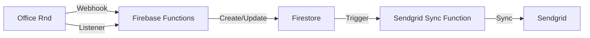
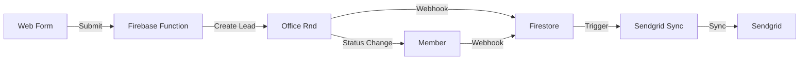

# Office Rnd Integration System

## Architecture Overview

This system implements a **webhook-driven architecture** between Office Rnd, Firestore, and Sendgrid. **Firestore serves as the source of truth for read operations**, while **Office Rnd remains the master system for write operations**. This approach provides optimal performance, consistency, and reliability.

### System Components

1. **Office Rnd (Master System)**
   - Core business logic and member management
   - Member lifecycle management (lead → trial → member)
   - Billing and payment processing
   - Member portal and admin dashboard
   - Built-in reporting and analytics
   - Primary member communication system
   - **Write operations only** (create, update, delete)

2. **Firestore (Source of Truth for Reads)**
   - **Primary data source for all read operations**
   - Mirrors Office Rnd data via webhooks
   - Provides data redundancy and backup
   - Enables fast, complex queries and reporting
   - Triggers downstream integrations
   - Maintains sync status with Office Rnd
   - **Read operations only** (get, query, filter)

3. **Sendgrid**
   - Email communication platform
   - Receives member data for email campaigns
   - Secondary system for member data

### Data Flow



1. **Office Rnd to Firestore**
   - Real-time updates via webhooks
   - Periodic sync via listener function
   - Maintains data consistency
   - Provides data redundancy

2. **Firestore to Sendgrid**
   - Triggered by Firestore document changes
   - Implements retry logic for failed syncs
   - Maintains sync status

### Data Access Patterns

#### Read Operations (Always from Firestore)
```typescript
// Fast, consistent reads from source of truth
const members = await officeRndService.getAllMembers();           // From Firestore
const opportunities = await officeRndService.getOpportunities({}); // From Firestore
const statuses = await officeRndService.getOpportunityStatuses();  // From Firestore
```

#### Write Operations (Always to OfficeRnd)
```typescript
// Triggers webhooks to update Firestore
await officeRndService.createMember(member);      // To OfficeRnd API
await officeRndService.updateMember(id, data);    // To OfficeRnd API
await officeRndService.createOpportunity(opp);    // To OfficeRnd API
```

#### Migration/Recovery Operations (Direct API Access)
```typescript
// For initial migration, data recovery, and validation
const members = await officeRndService.getAllMembersFromAPI();           // From OfficeRnd API
const opportunities = await officeRndService.getOpportunitiesFromAPI({}); // From OfficeRnd API
const statuses = await officeRndService.getOpportunityStatusesFromAPI();  // From OfficeRnd API
```

### Member Lifecycle Flow



1. **Lead Creation**
   - Web form submits to Firebase Function
   - Function creates lead in Office Rnd
   - Office Rnd webhook updates Firestore
   - Sendgrid sync triggered for welcome email

2. **Lead to Member Transition**
   - Office Rnd handles status change
   - Webhook updates Firestore
   - Sendgrid sync triggered for member onboarding

## Data Structure

### Firestore Collections

We use separate top-level collections for each entity type to optimize query performance and scalability:

```
/officeRndMembers/{memberId}
/officeRndOpportunities/{opportunityId}
/officeRndCompanies/{companyId}
/officeRndLocations/{locationId}
/officeRndEvents/{eventId}
/officeRndBookings/{bookingId}
/officeRndMetadata/{metadataType}  // For tokens, statuses, configs, etc.
```

### Member Document

```typescript
interface Member {
  id: string;
  officeRndId: string;
  email: string;
  name: string;
  status: 'lead' | 'trial' | 'member' | 'inactive';
  // other member fields from Office Rnd
  syncStatus: {
    lastOfficeRndSync: Timestamp;
    lastSendgridSync: Timestamp;
    officeRndStatus: 'synced' | 'pending' | 'failed';
    sendgridStatus: 'synced' | 'pending' | 'failed';
    error?: string;
  };
  metadata: {
    createdAt: Timestamp;
    updatedAt: Timestamp;
    createdBy: string;
    updatedBy: string;
  };
}
```

### Why Separate Collections?

1. **Query Performance**: Independent queries without complex subcollection joins
2. **Scalability**: Each collection scales independently
3. **Security Rules**: Granular access control per entity type
4. **Indexing**: Automatic Firestore indexing for top-level collections
5. **Cost Efficiency**: More efficient than subcollections for large datasets

## Development Guidelines

### 1. Code Organization

- Keep functions modular and single-purpose
- Implement proper error handling
- Use TypeScript for type safety
- Follow Firebase Functions best practices
- Maintain clear sync status tracking

### 2. Testing

- Write unit tests for all functions
- Implement integration tests for data flow
- Test error scenarios and edge cases
- Maintain test coverage
- Test sync reliability

### 3. Error Handling

- Implement proper error logging
- Use retry mechanisms for transient failures
- Maintain error state in Firestore
- Alert on critical failures
- Handle webhook failures gracefully

### 4. Security

- Validate all webhook requests
- Implement proper authentication
- Follow least privilege principle
- Secure sensitive data
- Regular backup verification

### 5. Monitoring

- Set up proper logging
- Monitor function execution
- Track sync status
- Alert on failures
- Monitor data consistency

### 6. Webhook Implementation

#### Webhook Handler
```typescript
// Handles real-time updates from OfficeRnd
private handleWebhook: RequestHandler = async (request, response, next) => {
  // Verify webhook signature
  this.verifyOfficeRndSignature(rawBody, officeRndSignature);
  
  // Send 200 OK response immediately
  response.status(200).send('OK');
  
  // Process webhook data
  const {eventType, data} = body;
  switch (eventType) {
    case 'membership.created':
    case 'membership.updated':
    case 'membership.removed':
      // Update Firestore
      break;
  }
};
```

#### Scheduled Validation
```typescript
// Daily sync to catch missed webhooks
export const validateOfficeRndSync = functions.pubsub
  .schedule('every 24 hours')
  .onRun(async (context) => {
    // Compare Firestore vs OfficeRnd data
    // Rebuild missing data if needed
    // Alert on inconsistencies
  });
```

#### Data Freshness Monitoring
- Alert when collections are empty
- Monitor webhook failure rates
- Track data staleness
- Validate sync timestamps

## Future Considerations

1. **Migration Path**
   - Maintain complete data mirror in Firestore
   - Regular backup verification
   - Document data mapping
   - Plan for potential Office Rnd replacement

2. **Custom Features**
   - Build custom reporting on Firestore data
   - Implement additional integrations
   - Add custom analytics
   - Develop specialized member features

3. **System Evolution**
   - Monitor Office Rnd limitations
   - Track custom feature requirements
   - Plan for potential system replacement
   - Maintain data portability

## Getting Started

### 1. Initial Setup

1. **Configure OfficeRnd Webhook**
   ```bash
   # Set webhook URL in OfficeRnd dashboard
   https://your-project.cloudfunctions.net/webhook/office-rnd
   ```

2. **Initialize Data Migration**
   ```bash
   # Call initialization endpoint (one-time only)
   curl -X GET "https://your-project.cloudfunctions.net/v1/initialize/office-rnd" \
        -H "savage-secret: your-secret-key"
   ```

3. **Verify Webhook Integration**
   ```typescript
   // Check if data is being synced
   const members = await officeRndService.getAllMembers();
   console.log(`Found ${members.length} members in Firestore`);
   ```

### 2. Usage Examples

#### Reading Data (From Firestore)
```typescript
// Fast reads from source of truth
const allMembers = await officeRndService.getAllMembers();
const opportunities = await officeRndService.getOpportunities({});
const statuses = await officeRndService.getOpportunityStatuses();
```

#### Writing Data (To OfficeRnd)
```typescript
// Triggers webhooks to update Firestore
await officeRndService.createMember({
  name: 'John Doe',
  email: 'john@example.com',
  location: 'location-id'
});

await officeRndService.updateMember('member-id', {
  properties: { status: 'member' }
});
```

#### Data Recovery (From OfficeRnd API)
```typescript
// For migration or recovery scenarios
const members = await officeRndService.getAllMembersFromAPI();
const opportunities = await officeRndService.getOpportunitiesFromAPI({});
```

### 3. Monitoring

- Check webhook logs in Firebase Console
- Monitor scheduled function execution
- Set up alerts for empty collections
- Track data freshness metrics

## Contributing

1. Follow the established code style
2. Write tests for new features
3. Update documentation
4. Submit pull requests

## License

[Your License Here] 