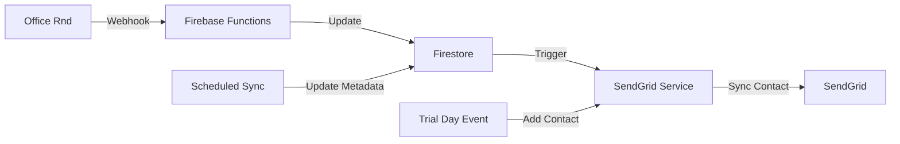

# SENDGRID README

#### Lists:
- leads
- members
- newsletter

#### Reserved Fields:
- first_name
- last_name
- email
- phone_number_id (main phone)
- external_id (app_id can be office and or firebase in the future)
- phone_number (WhatsApp phone if diff from phone_number_id)

#### Custom Fields:
**General**:
- location (e.g. "Estepona, Spain")
- tags (comma-separated, or use SendGrid's native tagging if needed)
**Membership**:
- membership_status (active, on-leave, drop-in, trial, former, lead)
	- active when has an active recurring membership
	- drop-in when has active day-passes
	- on-leave when inactive but coming back within 3 months
	- trial has had a trial day but not a membership
	- former had a membership or was a drop-in
	- lead has not had a trial or memerbship yet.
- membership_start_date
- membership_end_date
- trial_start_date (populated when user signs up for trial)
- trial_end_date (populated when user has completed trial)
**Engagement**:
- last_checkin_date
- event_attendee (yes, no, savage_friday_only, rooftop_sessions_only, etc..)
- newsletter_opt_in (true, false)
- engagement_score (manual or automated: 1-10)
**Source Tracking**:
- signup_source:
  - typeform-trial-day
  - typeform-contact
- referrer_email

## Dynamic Templates

We use dynamic templates in Sendgrid to send transactional emails. Following is a list of email templates available:
- trial-day
- confirm-email

### Trial Day

template id: d-25105204bd734ff49bcfb6dbd3ce4deb
Custom params: {
	first_name: string;
	trial_date: string;
	trial_start_time: string;
}

### Confirm Email

template id: d-eebf7469a11a42fdac5996371583e259
Custom params: {
	first_name: string;
	confirm_email_link: string;
}

# SendGrid Integration System

## Architecture Overview

This system implements a **hybrid architecture** for managing SendGrid contacts with **Firestore as the source of truth for metadata** and **SendGrid API for contact operations**. The system supports multiple contact lists (leads, members, newsletter) with intelligent list assignment based on member status and properties.

### System Components

1. **SendGrid (Contact Management)**
   - Email communication platform
   - Contact list management (leads, members, newsletter)
   - Dynamic email templates
   - Contact lifecycle management

2. **Firestore (Metadata Source of Truth)**
   - **Primary source for SendGrid metadata** (list IDs, custom field IDs)
   - Stores contact sync status and history
   - Provides fast access to configuration data
   - Enables offline capability and data recovery

3. **Office Rnd Integration**
   - Webhook-driven contact sync
   - Real-time member status updates
   - Automatic list assignment based on member lifecycle

### Data Flow



1. **Real-time Contact Sync**
   - Office Rnd webhook triggers contact updates
   - SendGrid service resolves metadata from Firestore
   - Intelligent list assignment based on member status
   - Automatic custom field mapping

2. **Scheduled Metadata Sync**
   - Periodic sync of SendGrid metadata to Firestore
   - Ensures list IDs and custom field IDs are current
   - Provides fallback for dynamic resolution

## Contact Lists

### List Structure

- **leads**: Prospects and trial users
- **members**: Active paying members
- **newsletter**: Newsletter subscribers (opt-in)

### List Assignment Logic

```typescript
// Intelligent list assignment based on member status
if (member.status === OfficeRndMemberStatus.LEAD || 
    member.status === OfficeRndMemberStatus.CONTACT) {
  listNames.push('leads');
}

if (member.status === OfficeRndMemberStatus.ACTIVE) {
  listNames.push('members');
}

// Newsletter list managed separately via opt-in
if (member.newsletterOptIn) {
  listNames.push('newsletter');
}
```

## Data Structure

### Firestore Collections

```
/sendgridMetadata/
  /lists/
    /leads: { id: string, name: string, contactCount: number }
    /members: { id: string, name: string, contactCount: number }
    /newsletter: { id: string, name: string, contactCount: number }
  /customFields/
    /first_name: { id: string, name: string, type: string }
    /last_name: { id: string, name: string, type: string }
    /membership_status: { id: string, name: string, type: string }
    /location: { id: string, name: string, type: string }
    /trial_start_date: { id: string, name: string, type: string }
    /trial_end_date: { id: string, name: string, type: string }
    /membership_start_date: { id: string, name: string, type: string }
    /membership_end_date: { id: string, name: string, type: string }
    /last_checkin_date: { id: string, name: string, type: string }
    /event_attendee: { id: string, name: string, type: string }
    /newsletter_opt_in: { id: string, name: string, type: string }
    /engagement_score: { id: string, name: string, type: string }
    /signup_source: { id: string, name: string, type: string }
    /referrer_email: { id: string, name: string, type: string }
  /lastSync: { timestamp: Timestamp, status: string }
```

### Contact Data Model

```typescript
interface SendGridContact {
  email: string;
  firstName?: string;
  lastName?: string;
  phoneNumber?: string;
  externalId?: string;
  customFields: {
    membership_status?: string;
    location?: string;
    trial_start_date?: string;
    trial_end_date?: string;
    membership_start_date?: string;
    membership_end_date?: string;
    last_checkin_date?: string;
    event_attendee?: string;
    newsletter_opt_in?: boolean;
    engagement_score?: number;
    signup_source?: string;
    referrer_email?: string;
  };
  listIds: string[];
  syncStatus: {
    lastSync: Timestamp;
    status: 'synced' | 'pending' | 'failed';
    error?: string;
  };
}
```

## Service Architecture

### SendGridService

The service follows a **separation of concerns** pattern with distinct read and write operations:

#### Read Operations (From Firestore)
```typescript
// Fast, consistent reads from source of truth
const lists = await sendgridService.getLists();                    // From Firestore
const customFields = await sendgridService.getCustomFields();      // From Firestore
const listId = await sendgridService.getListIdByName('leads');     // From Firestore
```

#### Write Operations (To SendGrid API)
```typescript
// Direct API operations for contact management
await sendgridService.addContactToLists(contact, listIds);        // To SendGrid API
await sendgridService.updateContact(contact);                     // To SendGrid API
await sendgridService.removeContactFromLists(email, listIds);     // To SendGrid API
```

#### Migration/Recovery Operations (From SendGrid API)
```typescript
// For initial migration, data recovery, and validation
const lists = await sendgridService.getListsFromAPI();            // From SendGrid API
const customFields = await sendgridService.getCustomFieldsFromAPI(); // From SendGrid API
```

### Key Methods

#### Contact Management
```typescript
// Add contact to multiple lists with custom fields
async addContactToLists(contact: SendGridContact, listNames: string[]): Promise<void>

// Update existing contact
async updateContact(contact: SendGridContact): Promise<void>

// Remove contact from specific lists
async removeContactFromLists(email: string, listNames: string[]): Promise<void>

// Sync Office Rnd member to SendGrid
async syncMemberToSendGrid(member: OfficeRndMember): Promise<void>
```

#### Metadata Management
```typescript
// Get list ID by name (from Firestore)
async getListIdByName(listName: string): Promise<string>

// Get custom field ID by name (from Firestore)
async getCustomFieldIdByName(fieldName: string): Promise<string>

// Update metadata from SendGrid API (scheduled sync)
async syncMetadataFromAPI(): Promise<void>
```

## Integration Points

### Office Rnd Webhook Integration

The Office Rnd webhook controller handles member events and delegates SendGrid operations:

```typescript
// Office Rnd webhook controller
export class OfficeRndController {
  async handleMemberCreated(member: OfficeRndMember): Promise<void> {
    // Update Firestore
    await this.firestoreService.setOfficeRndMember(member);
    
    // Sync to SendGrid
    await this.sendgridService.syncMemberToSendGrid(member);
  }
}
```

### Trial Day Event Integration

Trial day events trigger SendGrid contact addition:

```typescript
// Trial day event trigger
export class TrialDayEvents {
  async onTrialDayCreated(trialDay: TrialDay): Promise<void> {
    // Add to leads list
    await this.sendgridService.addContactToLists(
      this.mapTrialDayToContact(trialDay),
      ['leads']
    );
  }
}
```

## Reserved Fields

SendGrid reserved fields are automatically mapped:

- **first_name**: Member's first name
- **last_name**: Member's last name
- **email**: Primary email address
- **phone_number_id**: Main phone number
- **external_id**: Office Rnd member ID
- **phone_number**: WhatsApp phone (if different from main)

## Custom Fields

### General Fields
- **location**: Member's location (e.g., "Estepona, Spain")
- **tags**: Comma-separated tags or SendGrid native tagging

### Membership Fields
- **membership_status**: 
  - `active`: Has active recurring membership
  - `drop-in`: Has active day-passes
  - `on-leave`: Inactive but returning within 3 months
  - `trial`: Had trial day but no membership
  - `former`: Had membership or was drop-in
  - `lead`: No trial or membership yet
- **membership_start_date**: Date membership began
- **membership_end_date**: Date membership ended
- **trial_start_date**: Date trial began
- **trial_end_date**: Date trial ended

### Engagement Fields
- **last_checkin_date**: Most recent check-in
- **event_attendee**: Event participation (yes, no, savage_friday_only, etc.)
- **newsletter_opt_in**: Newsletter subscription status
- **engagement_score**: Manual or automated score (1-10)

### Source Tracking Fields
- **signup_source**: 
  - `typeform-trial-day`
  - `typeform-contact`
- **referrer_email**: Referral source email

## Dynamic Templates

### Available Templates

- **trial-day**: `d-25105204bd734ff49bcfb6dbd3ce4deb`
  - Params: `first_name`, `trial_date`, `trial_start_time`

- **confirm-email**: `d-eebf7469a11a42fdac5996371583e259`
  - Params: `first_name`, `confirm_email_link`

## Development Guidelines

### 1. Error Handling

```typescript
// Robust error handling with retry logic
try {
  await this.sendgridService.syncMemberToSendGrid(member);
} catch (error) {
  // Log error and update sync status
  await this.updateSyncStatus(member.id, 'failed', error.message);
  
  // Retry logic for transient failures
  if (this.isRetryableError(error)) {
    await this.scheduleRetry(member.id);
  }
}
```

### 2. Data Consistency

- Always read metadata from Firestore for consistency
- Use scheduled sync to keep metadata current
- Implement proper error handling and retry logic
- Maintain sync status tracking

### 3. Performance Optimization

- Cache frequently accessed metadata
- Batch operations when possible
- Use Firestore for fast metadata lookups
- Implement proper indexing

### 4. Security

- Validate all input data
- Use environment variables for API keys
- Implement proper error logging
- Follow least privilege principle

### 5. Monitoring

- Track sync success/failure rates
- Monitor API rate limits
- Alert on critical failures
- Monitor data consistency

## Scheduled Functions

### Metadata Sync

```typescript
// Scheduled function to sync SendGrid metadata
export async function updateSendGridMetadata(): Promise<void> {
  const sendgridService = new SendGridService();
  await sendgridService.syncMetadataFromAPI();
}
```

**Schedule**: Daily at 2:00 AM UTC

**Purpose**: 
- Updates list IDs and custom field IDs in Firestore
- Ensures metadata is current for dynamic resolution
- Provides fallback for API failures

## Testing

### Unit Tests

```typescript
// Test list assignment logic
describe('SendGridService', () => {
  it('should assign lead to leads list', async () => {
    const member = createMockMember({ status: OfficeRndMemberStatus.LEAD });
    const listNames = await service.determineListNames(member);
    expect(listNames).toContain('leads');
  });
});
```

### Integration Tests

```typescript
// Test end-to-end sync flow
describe('Office Rnd to SendGrid Sync', () => {
  it('should sync new member to SendGrid', async () => {
    const member = createMockMember();
    await controller.handleMemberCreated(member);
    
    // Verify contact was added to SendGrid
    const contact = await sendgridService.getContact(member.email);
    expect(contact).toBeDefined();
  });
});
```

## Troubleshooting

### Common Issues

1. **Metadata Not Found**
   - Check if scheduled sync is running
   - Verify Firestore metadata collection
   - Run manual metadata sync

2. **Contact Sync Failures**
   - Check API rate limits
   - Verify contact data format
   - Review error logs

3. **List Assignment Issues**
   - Verify member status mapping
   - Check list ID resolution
   - Review custom field mapping

### Debug Commands

```bash
# Check metadata sync status
firebase functions:log --only updateSendGridMetadata

# Verify webhook delivery
firebase functions:log --only officeRndWebhook

# Test contact sync manually
curl -X POST /api/v1/sendgrid/sync-member -d '{"memberId": "..."}'
```
